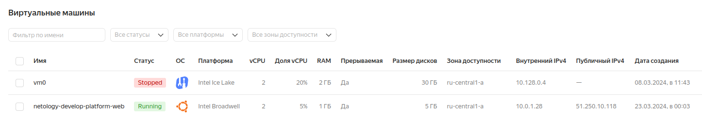

# Домашнее задание к занятию «Основы Terraform. Yandex Cloud»

### Задание 1

Ошибки:
platform_id = "standart-v4" - неверное указание платформы, "v4" изменено на "v1", "standart" на "standard"
для платформы 'standard-v1" некорректное значение числа ядер, изменено на cores = 2





```preemptible```  - прерываемая ВМ, останавливается не позднее 24 часов, может быть остановлена YC в любой момент при неватке ресурсов в зоне доступности. Позволяет экономить средства на аккаунте в случае, если ВМ не была выключена.

```core_fraction``` - гарантированнаая доля vCPU, которая будет выделена ВМ. Значение в 5% достаточно в целх обучения, низкая стоимость

------

### Задание 2


------

### Задание 3


------

### Задание 4


------

итоговые файлы проекта в [**репозитории**](https://github.com/kesson11/terraform-02)